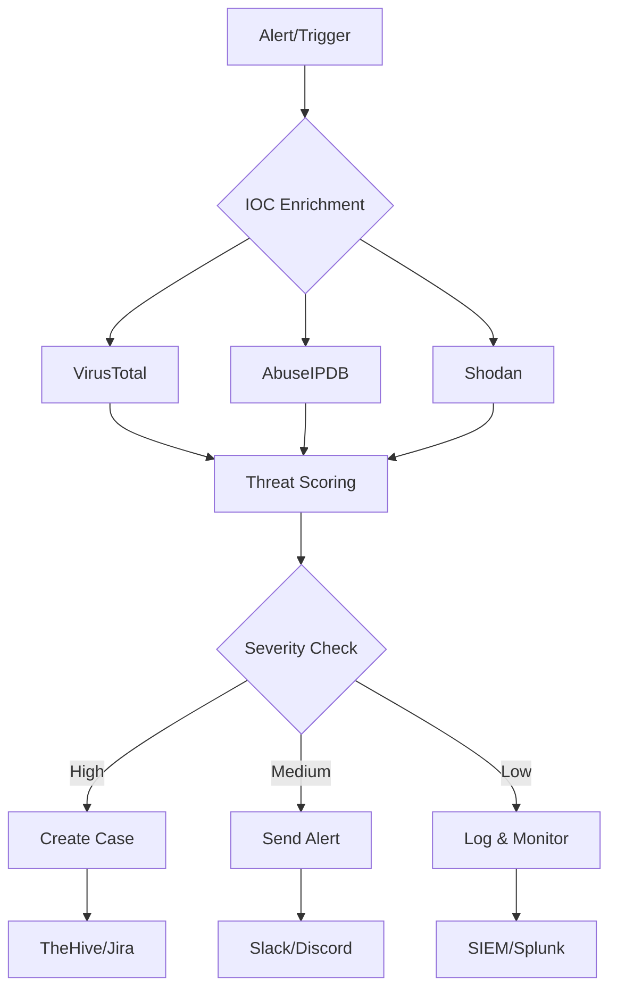

# 🔐 **n8n Security Automation Toolkit**

[](https://n8n.io)
[](LICENSE)
[](CONTRIBUTING.md)
[](#featured-workflows)
[](CHANGELOG.md)

A **production-ready collection** of n8n workflows for **cybersecurity automation**, **incident response**, and **threat intelligence**. Import these JSON templates directly into your n8n instance (Self-hosted, Cloud, or Desktop).

---

## 📦 **What's Included**

### **🎯 Ready-to-Deploy Workflows:**
- **IOC Enrichment** (IP, domain, file hash, URL)
- **Threat Intelligence** (VirusTotal, AbuseIPDB, Shodan, MISP, Hybrid-Analysis)
- **Alert & Notification** (Slack, Discord, Email, Teams, PagerDuty)
- **Case Management** (Jira, GitHub Issues, TheHive, ServiceNow)
- **Log Processing** (SIEM integration, log parsing, webhook handlers)
- **Security Automation** (Auto-triage, escalation, response playbooks)

### **🔄 Reusable Components:**
- **Rate limiting** with exponential backoff
- **Error handling** & circuit breakers
- **Data normalization** pipelines
- **API pagination** handlers
- **Credential management** templates

> 🛡️ **All workflows are designed for defensive security operations (Blue Team).**  
> ⚠️ **Use only for authorized security testing and legitimate incident response.**

---

## 🚀 **Quick Start**

```bash
# 1. Clone the repository
git clone https://github.com/<your-org>/n8n-security-automation.git
cd n8n-security-automation

# 2. Configure environment (copy example)
cp .env.example .env
# Edit .env with your API keys

# 3. Import workflows into n8n
# Via UI: Workflow → Import from File → Select .json
# Or use CLI with n8n API
```

### **📥 Import via n8n UI:**
1. Open n8n Editor (`http://your-n8n-instance.com/workflow`)
2. Click **Workflow** → **Import from File**
3. Select any `.json` from `workflows/` folder
4. Configure credentials for each service
5. Click **Execute Workflow** to test

### **🔧 Environment Variables:**
```env
# Required API Keys
VT_API_KEY=your_virustotal_key
ABUSEIPDB_API_KEY=your_abuseipdb_key
SHODAN_API_KEY=your_shodan_key
SLACK_WEBHOOK_URL=https://hooks.slack.com/services/...
DISCORD_WEBHOOK_URL=https://discord.com/api/webhooks/...

# Optional
MISP_URL=https://your-misp.instance
MISP_API_KEY=your_misp_key
THEHIVE_URL=https://your-thehive.instance
THEHIVE_API_KEY=your_thehive_key
```

---

## 🔥 **Featured Workflows**

| Workflow | Category | Input | Output | Status |
|----------|----------|-------|--------|--------|
| **[🔍 IOC Enrichment Pipeline]** | Threat Intel | IP/Domain/Hash | Multi-source reputation | ✅ Production Ready |
| **[🚨 Slack Threat Digest]** | Alerting | IOC List/RSS | Formatted daily report | ✅ Production Ready |
| **[🎯 TheHive Case Creation]** | Case Mgmt | Webhook Alert | Automated case + observables | ✅ Production Ready |
| **[📊 Jira Incident Ticket]** | Case Mgmt | Alert Payload | Jira issue with labels | ✅ Production Ready |
| **[🔄 HTTP Retry Subflow](** | Utilities | HTTP Call | Resilient request with backoff | ✅ Reusable Component |
| **[📨 Log Ingestion Parser]** | Log Processing | Raw Logs | Structured JSON events | ✅ Production Ready |
| **[🔐 Credential Rotation]** | Security Ops | Service List | Automated rotation triggers | 🚧 Beta |
| **[📈 Security Metrics]** | Reporting | Multiple Sources | Dashboard-ready metrics | ✅ Production Ready |

---

## 🏗️ **Architecture**



---

## 🛡️ **Security Best Practices**

### **✅ Do:**
- Use **environment variables** for all secrets
- Implement **rate limiting** for external APIs
- Add **manual approval nodes** for destructive actions
- Enable **n8n audit logging**
- Regular **credential rotation**

### **❌ Don't:**
- Hardcode API keys in workflows
- Run without testing in sandbox first
- Use for unauthorized systems
- Skip error handling implementation

---

## 🧪 **Testing**

### **Manual Test:**
```bash
# Test webhook trigger
curl -X POST http://your-n8n/webhook/test \
  -H "Content-Type: application/json" \
  -d '{
    "indicator": "8.8.8.8",
    "type": "ip",
    "source": "test"
  }'
```

### **Sample Payload:**
```json
{
  "indicator": "malicious-domain.com",
  "type": "domain",
  "timestamp": "2024-01-15T10:30:00Z",
  "source": "IDS Alert",
  "severity": "high"
}
```

---

## 📚 **Documentation**

| Resource | Description |
|----------|-------------|
| **[📖 Workflow Guide]** | How to customize and extend workflows |
| **[🔧 API Reference]** | External API integration details |
| **[🛡️ Security Guidelines]** | Compliance and security practices |
| **[🚀 Deployment Guide]** | Production deployment instructions |
| **[🧪 Testing Guide]** | Testing and validation procedures |

---

## 🤝 **Contributing**

We welcome contributions! Please see our [Contributing Guide](CONTRIBUTING.md).

1. **Fork** the repository
2. **Create** a feature branch (`git checkout -b feature/amazing-workflow`)
3. **Add** your workflow JSON to appropriate folder
4. **Include** documentation in the workflow header
5. **Test** thoroughly
6. **Submit** a Pull Request

### **Workflow Template:**
```json
{
  "name": "Your Workflow Name",
  "nodes": [...],
  "settings": {...},
  "version": 1,
  "documentation": {
    "description": "Brief description",
    "inputs": ["list", "of", "inputs"],
    "outputs": ["expected", "outputs"],
    "requirements": ["API keys needed"],
    "author": "Your Name",
    "version": "1.0.0"
  }
}
```

---

## 🗺️ **Roadmap**

### **Short Term (Q1 2024):**
- [ ] Microsoft Sentinel integration
- [ ] Splunk SOAR migration helpers
- [ ] Additional SIEM connectors
- [ ] Enhanced error recovery

### **Long Term (2024):**
- [ ] Machine learning anomaly detection
- [ ] Automated playbook generation
- [ ] Cross-platform migration tools
- [ ] Community workflow marketplace

---

## ❓ **FAQ**

### **Q: Which n8n version is required?**
**A:** v1.40+ recommended. Some features may require v1.45+.

### **Q: Can I use these with n8n Cloud?**
**A:** Yes! All workflows are compatible with n8n Cloud, Desktop, and Self-hosted.

### **Q: How do I handle API rate limits?**
**A:** Use the included `http-retry-subflow.json` which implements exponential backoff.

### **Q: Are these workflows SOC2 compliant?**
**A:** They follow security best practices but require your organization's specific compliance validation.

### **Q: How do I contribute a workflow?**
**A:** See [CONTRIBUTING.md](CONTRIBUTING.md) for guidelines and templates.

---

## 📄 **License**

This project is licensed under the **MIT License** - see the [LICENSE](LICENSE) file for details.

```
MIT License
Copyright (c) [Year] [Author]
Permission is hereby granted, free of charge, to any person...
```

---

## ⚠️ **Disclaimer**

> **These workflows are provided "AS IS" without warranty of any kind.**  
> Use only for **authorized security testing** and **legitimate incident response**.  
> The authors assume **no liability** for misuse or unauthorized access.  
> Always obtain **proper authorization** and comply with **applicable laws**.

---

<div align="center">
  <sub>Built with 🔐 by the security community | Automate responsibly</sub>
</div>
